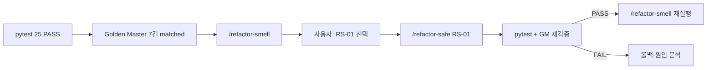

# UnitConverter_17 — REFACTOR Command · RS-01 완료 보고서 (05)

> 작성 기준: refactoring 브랜치 REFACTOR TDD · C2C · SRP/OCP · ARRR · Change Budget  
> 선행: [04.Green_Minimal_Command_Completion_Report.md](04.Green_Minimal_Command_Completion_Report.md)  
> PRD: [docs/PRD.md](../docs/PRD.md)  
> TRACEABILITY: [docs/TRACEABILITY.md](../docs/TRACEABILITY.md)  
> Command: [.cursor/commands/refactor-smell.md](../.cursor/commands/refactor-smell.md), [.cursor/commands/refactor-safe.md](../.cursor/commands/refactor-safe.md)  
> Transcript: [Prompting/05.Refactor_Command_Completion_Report-prompt.md](../Prompting/05.Refactor_Command_Completion_Report-prompt.md)

---

## 1. 세션 목적

GREEN 25 PASS·Golden Master 7건 고정(Report 04) 이후, **REFACTOR(Refine)** 단계를 안전하게 진행하기 위한 Cursor Command 쌍을 정의하고, **첫 구조 개선(RS-01)** 을 실행한다.

| Part | Command / 작업 | 역할 | 상태 |
|------|----------------|------|------|
| **A** | `/refactor-smell` Command | 스멜 분석 절차 정의 | ✅ Command 정의 |
| **B** | `/refactor-safe` Command | 선택 스멜 1건 리팩터 절차 정의 | ✅ Command 정의 |
| **C** | `/refactor-smell` 실행 | P0/P1/P2 스멜 표·RS 후보 확정 | ✅ 실행 완료 |
| **D** | `/refactor-safe RS-01` | CLI 출력 → Formatter 분리 | ✅ 실행 완료 |

- **ARRR 단계:** REFACTOR (Refine)
- **대상 NFR:** NFR-02 (SRP), NFR-06 (Formatter 분리)
- **범위 밖:** RS-02·RS-03, 테스트 기대값 변경, approved 갱신, FR-04 RED

---

## 2. 선행 상태 (Report 04 기준)

| 항목 | 상태 |
|------|------|
| GREEN pytest | **25 PASS** (Domain 11 + Boundary 7 + Golden Master 7) |
| Golden Master | GM-01~07 **matched** |
| 구조 부채 (Report 04 자가 점검) | Formatter 미분리, CLI SRP 혼재 — **RS-01으로 Formatter 분리 완료** |
| TRACEABILITY P3 | `T-ARCH-SRP-01`, `T-ARCH-OCP-01` — REFACTOR 후 검증 예정 |

---

## 3. Part A — `/refactor-smell` Command 산출물

### 3.1 생성 파일

| 파일 | 역할 | 상태 |
|------|------|------|
| [.cursor/commands/refactor-smell.md](../.cursor/commands/refactor-smell.md) | REFACTOR 전 스멜 분석·후보 제안 절차 | ✅ **신규** (203 lines) |

### 3.2 Command 핵심 계약

| 항목 | 내용 |
|------|------|
| Phase | REFACTOR (Refine) — **분석 전용** |
| Scope | `unit_converter/`, `tests/` (읽기·분석만) |
| Track | Logic + UI |
| 전제 | `pytest tests/ -v` PASS; Golden Master 존재 시 추가 PASS |
| 스멜 8종 | Long Method, Duplicated Code, Mysterious Name, Magic Number, 계층 위반, Feature Envy, OCP 위반, SRP 위반 |
| 우선순위 | P0 / P1 / P2 가이드 + UnitConverter 체크 포인트 |
| Change Budget | 수정 파일 ≤3, 신규 클래스 ≤1, 신규 메서드 ≤3, 동작·테스트·approved 변경 금지 |
| 출력 | 스멜 표 → RS 후보 1~3개 → 전제 요약 → P0 1개 선택 후 `/refactor-safe` 안내 |
| 금지 | 코드·테스트·docs·commit·`/refactor-safe` 실행 |

### 3.3 UnitConverter 계층·SRP 매핑 (Command 내장)

| 계층 | 책임 | import·동작 금지 |
|------|------|------------------|
| `domain/` | Registry, 변환 계산 | 상위 계층 import |
| `app/` | 파싱, 포맷, 경계 처리 | 변환 직접 수행 |
| `infrastructure/` | 설정 로드 | 변환·포맷 직접 수행 |
| `cli.py` | 진입점·조율 | 비즈니스 로직 직접 보유 |

| 컴포넌트 | 목표 모듈 | PRD |
|----------|-----------|-----|
| Parser | `app/input_parser.py` | IN-01, FR-VAL-01~02 |
| Registry | `domain/unit_registry.py` | NFR-03, FR-CFG-01 |
| Converter | `domain/converter.py` | FR-CONV-01~03 |
| Formatter | `app/output_formatter.py` | FR-FMT-01, NFR-06 |
| CLI | `cli.py` | NFR-02 |

---

## 4. Part B — `/refactor-safe` Command 산출물

### 4.1 생성 파일

| 파일 | 역할 | 상태 |
|------|------|------|
| [.cursor/commands/refactor-safe.md](../.cursor/commands/refactor-safe.md) | 선택 스멜 1건 안전 리팩터 실행 절차 | ✅ **신규** (258 lines) |

### 4.2 Command 핵심 계약

| 항목 | 내용 |
|------|------|
| Phase | REFACTOR (Refine) — **Mode: Agent** |
| Scope | `unit_converter/` 수정, `tests/` 검증만 |
| 선행 | `/refactor-smell` 결과 + 사용자 후보 1건 **명시** (`RS-01`, `SRP cli` 등) |
| 전제 | 사전·사후 `pytest tests/ -v` PASS; Golden Master PASS (존재 시) |
| Change Budget | smell과 동일 한도 — 1회 1스멜 |
| 허용 | `unit_converter/**` 구조 개선 (계층·책임 정렬) |
| 금지 | 테스트 기대값, `tests/golden/*.approved.txt`, `UPDATE_GOLDEN=1`, 스멜 2건 이상, 새 FR |
| 사후 검증 | 전체 pytest + Golden Master + 보호 테스트 `-k` + `git diff` 금지 파일 확인 |
| 커밋 | `refactor: <영역> — <NFR> ...` (사용자 요청 시만) |

---

## 5. Part C — `/refactor-smell` 실행 (스멜 분석)

### 5.1 전제 확인

```bash
python -m pytest tests/ -v
python -m pytest tests/test_golden_master.py -v
```

| 항목 | 결과 |
|------|------|
| pytest 전체 | **25 PASS** |
| Golden Master | **7 PASS** |

### 5.2 스캔 범위

| 범위 | 내용 |
|------|------|
| `unit_converter/` | 소스 7개 (`cli.py`, `app/` 2, `domain/` 3, `infrastructure/` 1) |
| `tests/` | Boundary 7, Domain 11, Golden Master 7 — Architecture 테스트(`T-ARCH-*`) 미작성 |

### 5.3 스멜 표 (확정)

| 우선순위 | 스멜 | 위치 | 근거 | Change Budget 내 후보 |
|---|---|---|---|---|
| **P0** | SRP 위반 | `cli.py:handle_input` | 파싱·검증·변환 조율·**출력 포맷 조립** 혼재 (NFR-02). Golden Master가 `output_lines` 형식에 결합 | RS-01: Formatter 분리 |
| **P1** | Duplicated Code | `cli.py` ↔ `input_parser.py` | CLI 인라인 `split`·`float` 후 `parse(raw)` 재호출 | RS-02 |
| **P1** | Long Method | `cli.py:handle_input` (42행) | 책임 4개 단일 메서드 집중 | RS-01/RS-02 적용 시 해소 |
| **P1** | Feature Envy | `cli.py:55~58` (리팩터 전) | 출력 조립이 Formatter 책임(NFR-06)인데 CLI가 직접 수행 | RS-01 |
| **P1** | SRP (스텁) | `output_formatter.py`, `length_unit.py`, `config_loader.py` | 목표 컴포넌트 미구현·주석만 | RS-01(Formatter) 우선 |
| **P2** | Mysterious Name | `input_parser.py:6` | `value_str.split(":", 1)[0]` 중복 split | RS-03 |
| **없음** | Magic Number | `unit_converter/` | 비율 SSOT `unit_registry.py` 준수 (NFR-03) | — |
| **없음** | 계층 위반 | import 그래프 | domain→상위 import 없음 | — |
| **없음** | OCP 위반 | `converter.py` | Registry 기반, `if/elif` 없음 | — |

### 5.4 `/refactor-safe` 후보 (제안)

| 후보 ID | 목표 | 수정 예상 파일 | 보호 테스트 | 위험도 |
|---|---|---|---|---|
| **RS-01** | Formatter text 출력 분리 (NFR-06) | `cli.py`, `output_formatter.py` | `test_golden_master.py`, `-k gm0` | 중간 |
| RS-02 | CLI 파싱·검증 app 위임 (NFR-02) | `cli.py`, `input_parser.py` | `test_cli.py`, GM | 중간 |
| RS-03 | parser 중복 split 제거 | `input_parser.py` | `-k parse` | 낮음 |

**선택:** 사용자 → **RS-01** (P0)

---

## 6. Part D — `/refactor-safe RS-01` 실행 (Formatter 분리)

### 6.1 적용 요약

| 항목 | 값 |
|------|-----|
| 선택 후보 | RS-01 |
| 대상 스멜 | SRP 위반 / Feature Envy |
| PRD·NFR 연결 | NFR-02, NFR-06, T-ARCH-SRP-01 |
| 수정 파일 | `unit_converter/cli.py`, `unit_converter/app/output_formatter.py` |
| 신규 클래스 / 메서드 | 0 / 1 (`format_text_lines`) |

### 6.2 Change Budget 준수

| 항목 | 한도 | 실제 | 준수 |
|------|------|------|------|
| 수정 파일 | ≤3 | 2 | ✅ |
| 신규 클래스 | ≤1 | 0 | ✅ |
| 신규 메서드 | ≤3 | 1 | ✅ |
| 외부 동작 | 변경 금지 | 동일 | ✅ |
| 테스트 기대값 | 변경 금지 | 미변경 | ✅ |
| Golden Master approved | 변경 금지 | 미변경 | ✅ |

### 6.3 구현 변경

| 파일 | 변경 요약 |
|------|-----------|
| [unit_converter/app/output_formatter.py](../unit_converter/app/output_formatter.py) | `format_text_lines()` 추가 — `f"{source_value} {source_unit} = {results[target]} {target}"` 리스트 생성 |
| [unit_converter/cli.py](../unit_converter/cli.py) | 인라인 출력 조립 제거 → `format_text_lines(unit_name, parsed_value, results, registry.all_units())` 호출 |

**구조 개선:** CLI는 검증·변환 조율 후 Formatter에 출력 라인 생성을 위임. f-string·`registry.all_units()` 순서·숫자 포맷은 GREEN 시점과 동일 유지.

### 6.4 사후 검증

```bash
python -m pytest tests/ -v
python -m pytest tests/test_golden_master.py -v
python -m pytest tests/ -v -k "gm0"
```

| 명령 | 결과 |
|------|------|
| `pytest tests/ -v` | **25 PASS** |
| `pytest tests/test_golden_master.py -v` | **7 PASS** |
| 보호 테스트 `-k "gm0"` | **7 PASS** |

### 6.5 diff·금지 파일 확인

| 대상 | 상태 |
|------|------|
| `tests/` 기대값 | ✅ 미변경 |
| `tests/golden/*.approved.txt` | ✅ 미변경 |
| `UnitConverter.py`, `docs/*` | ✅ 미변경 |
| `UPDATE_GOLDEN=1` | ✅ 미사용 |

---

## 7. REFACTOR Command 워크플로



| 단계 | Command | 산출 | 상태 |
|------|---------|------|------|
| 1 | (선행) `/golden-master` | approved 7건 | ✅ Report 04 |
| 2 | `/refactor-smell` | P0/P1/P2 스멜 표, RS-01~03 | ✅ **본 세션** |
| 3 | 사용자 선택 | RS-01 | ✅ |
| 4 | `/refactor-safe RS-01` | Formatter 분리 | ✅ **본 세션** |
| 5 | pytest + GM | 25 PASS 유지 | ✅ |
| 6 | 반복 또는 REPEAT | RS-02 등 또는 FR-04 RED | ⏳ 다음 |

---

## 8. ARRR · REFACTOR 단계 준수

| 항목 | 상태 | 비고 |
|------|------|------|
| ARRR 단계 | **REFACTOR (Refine)** | smell + safe RS-01 |
| 실제 코드 수정 | ✅ 2파일 | `cli.py`, `output_formatter.py` |
| pytest 사전·사후 | ✅ 25 PASS | Golden Master 7 PASS |
| 테스트 기대값 | ✅ 미변경 | |
| Golden Master approved | ✅ 미변경 | |
| `UnitConverter.py` | ✅ 미수정 | |
| RS-02·RS-03 | ✅ 미적용 | 1회 1스멜 준수 |
| skip / xfail | ✅ 0건 | |

---

## 9. Cursor Command 전체 목록 (갱신)

| Command | 파일 | ARRR | 용도 |
|---------|------|------|------|
| `/spec-review` | spec-review.md | spec | spec → red GO/NO-GO |
| `/red-test-plan` | red-test-plan.md | RED | RED 테스트 계획 |
| `/red-skeleton` | red-skeleton.md | RED | 실패 pytest 스켈레톤 |
| `/pytest-check` | pytest-check.md | 공통 | PASS/FAIL 요약 |
| `/green-minimal` | green-minimal.md | GREEN | 최소 구현 |
| `/golden-master` | golden-master.md | GREEN→REFACTOR | CLI 출력 계약 고정 |
| **`/refactor-smell`** | **refactor-smell.md** | **REFACTOR** | **스멜 분석·후보 제안** |
| **`/refactor-safe`** | **refactor-safe.md** | **REFACTOR** | **선택 스멜 1건 리팩터** |

**REFACTOR 작업 흐름:** `/refactor-smell` → 후보 선택 → `/refactor-safe RS-XX` → `/pytest-check` → `/refactor-smell` (반복)

---

## 10. 잔여 REFACTOR 대상 (RS-01 이후)

| 우선순위 | 스멜 | 위치 | NFR | 후보 |
|----------|------|------|-----|------|
| P1 | Duplicated Code | `cli.py` ↔ `input_parser.py` | NFR-02 | RS-02 |
| P1 | SRP (검증 인라인) | `cli.py:handle_input` | NFR-02 | RS-02 |
| P1 | Long Method | `handle_input()` | NFR-02 | RS-02 적용 시 해소 |
| P2 | Mysterious Name | `input_parser.py:6` | — | RS-03 |
| P2 | 스텁 | `length_unit.py`, `config_loader.py` | — | 별도 사이클 |

**RS-01으로 해소:** CLI 출력 포맷 조립 → `format_text_lines` (NFR-06 부분 달성)

---

## 11. C2C · REFACTOR 현황

| PRD / NFR | Test ID | GREEN | REFACTOR | 구조 검증 |
|-----------|---------|-------|----------|-----------|
| NFR-02 (SRP) | T-ARCH-SRP-01 | ✅ | ✅ RS-01 Formatter 분리 | ⏳ Architecture 테스트 |
| NFR-06 (Formatter) | — | ⏳ 스텁 | ✅ text 포맷 분리 | ⏳ JSON/CSV/표는 후속 FR |
| NFR-01 (OCP) | T-ARCH-OCP-01 | ✅ Registry 기반 | ✅ 변경 없음 | ⏳ |
| NFR-03 (비율 SSOT) | — | ✅ unit_registry.py | ✅ 유지 | ✅ |
| FR-04 | T-VAL-03 | ⏳ | — | REPEAT 후 RED |

---

## 12. 다음 단계

| 순서 | 작업 | Command | 비고 |
|------|------|---------|------|
| 1 | REFACTOR RS-01 커밋 | git commit | `refactor: formatter — NFR-06 text 출력 CLI 위임` |
| 2 | 잔여 스멜 분석 | `/refactor-smell` | RS-02(파싱·검증 위임) 후보 확인 |
| 3 | CLI SRP 2차 리팩터 | `/refactor-safe RS-02` | Change Budget 1회 |
| 4 | Architecture 검증 | `T-ARCH-SRP-01`, `T-ARCH-OCP-01` | P3 RED 또는 REFACTOR 후 |
| 5 | 미지원 단위 RED | `/red-test-plan` | FR-04 / T-VAL-03 |

**판정:** REFACTOR Command 쌍 **정의 완료** + **RS-01 구조 개선 완료** — `/refactor-smell` 재실행으로 잔여 스멜 확인 가능

---

## 13. 8계층 · 세션 완료

| 계층 | 산출 | 상태 |
|------|------|------|
| Mom Test | Report 01 | ✅ (선행) |
| PRD · TRACEABILITY | docs/ | ✅ (선행) |
| Rule · Command · Skill | `.cursorrules`, Commands | ✅ **+2 Command** |
| Harness | unit_converter/ 골격 | ✅ (선행) |
| RED · GREEN | Report 03~04, 25 PASS | ✅ (선행) |
| Golden Master | GM-01~07 | ✅ (선행) |
| **REFACTOR Command** | refactor-smell.md, refactor-safe.md | ✅ Part A·B |
| **REFACTOR 구현** | RS-01 Formatter 분리 | ✅ **Part C·D (본 세션)** |

---

## 14. 커밋 제안

**REFACTOR RS-01 (구현):**

```
refactor: formatter — NFR-06 text 출력 CLI 위임
```

**Report·Prompting 포함 시:**

```
docs: Report 05 — REFACTOR RS-01 완료 및 Transcript export
```

**REFACTOR Command (이전 세션, 미커밋 시):**

```
spec: add refactor-smell and refactor-safe Commands for safe REFACTOR workflow
```

---

## 문서 링크

| 문서 | 경로 |
|------|------|
| refactor-smell Command | [.cursor/commands/refactor-smell.md](../.cursor/commands/refactor-smell.md) |
| refactor-safe Command | [.cursor/commands/refactor-safe.md](../.cursor/commands/refactor-safe.md) |
| GREEN · GM 완료 Report | [Report/04.Green_Minimal_Command_Completion_Report.md](04.Green_Minimal_Command_Completion_Report.md) |
| TEST_LOOP REFACTOR | [docs/TEST_LOOP.md](../docs/TEST_LOOP.md) §3 |
| Transcript | [Prompting/05.Refactor_Command_Completion_Report-prompt.md](../Prompting/05.Refactor_Command_Completion_Report-prompt.md) |
