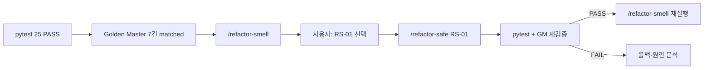

# UnitConverter_17 — REFACTOR Command 완료 보고서 (05)

> 작성 기준: refactoring 브랜치 REFACTOR TDD · C2C · SRP/OCP · ARRR · Change Budget  
> 선행: [04.Green_Minimal_Command_Completion_Report.md](04.Green_Minimal_Command_Completion_Report.md)  
> PRD: [docs/PRD.md](../docs/PRD.md)  
> TRACEABILITY: [docs/TRACEABILITY.md](../docs/TRACEABILITY.md)  
> Command: [.cursor/commands/refactor-smell.md](../.cursor/commands/refactor-smell.md), [.cursor/commands/refactor-safe.md](../.cursor/commands/refactor-safe.md)  
> Transcript: [Prompting/05.Refactor_Command_Completion_Report-prompt.md](../Prompting/05.Refactor_Command_Completion_Report-prompt.md)

---

## 1. 세션 목적

GREEN 25 PASS·Golden Master 7건 고정(Report 04) 이후, **REFACTOR(Refine)** 단계를 안전하게 진행하기 위한 Cursor Command 쌍을 정의한다.

| Part | Command | 역할 |
|------|---------|------|
| **A** | `/refactor-smell` | 코드 스멜 분석 전용 — `/refactor-safe` 후보 RS-01~03 제안 |
| **B** | `/refactor-safe` | 선택 스멜 1건만 Change Budget 내 리팩터 실행 |

- **ARRR 단계:** REFACTOR (Refine) — **Command 정의만** (본 세션에서 실제 리팩터·코드 스캔 미실행)
- **범위 밖:** `unit_converter/` 구현 변경, 테스트 기대값 변경, approved 갱신, 실제 `/refactor-smell` 스캔 실행

---

## 2. 선행 상태 (Report 04 기준)

| 항목 | 상태 |
|------|------|
| GREEN pytest | **25 PASS** (Domain 11 + Boundary 7 + Golden Master 7) |
| Golden Master | GM-01~07 **matched** |
| 구조 부채 (Report 04 자가 점검) | Formatter 미분리, CLI SRP 혼재 — **REFACTOR 예약** |
| TRACEABILITY P3 | `T-ARCH-SRP-01`, `T-ARCH-OCP-01` — REFACTOR 후 검증 예정 |

---

## 3. Part A — `/refactor-smell` Command 산출물

### 3.1 생성 파일

| 파일 | 역할 | 상태 |
|------|------|------|
| [.cursor/commands/refactor-smell.md](../.cursor/commands/refactor-smell.md) | REFACTOR 전 스멜 분석·후보 제안 절차 | ✅ **신규** (203 lines) |

### 3.2 Command 핵심 계약

| 항목 | 내용 |
|------|------|
| Phase | REFACTOR (Refine) — **분석 전용** |
| Scope | `unit_converter/`, `tests/` (읽기·분석만) |
| Track | Logic + UI |
| 전제 | `pytest tests/ -v` PASS; Golden Master 존재 시 추가 PASS |
| 스멜 8종 | Long Method, Duplicated Code, Mysterious Name, Magic Number, 계층 위반, Feature Envy, OCP 위반, SRP 위반 |
| 우선순위 | P0 / P1 / P2 가이드 + UnitConverter 체크 포인트 |
| Change Budget | 수정 파일 ≤3, 신규 클래스 ≤1, 신규 메서드 ≤3, 동작·테스트·approved 변경 금지 |
| 출력 | 스멜 표 → RS 후보 1~3개 → 전제 요약 → P0 1개 선택 후 `/refactor-safe` 안내 |
| 금지 | 코드·테스트·docs·commit·`/refactor-safe` 실행 |

### 3.3 UnitConverter 계층·SRP 매핑 (Command 내장)

| 계층 | 책임 | import·동작 금지 |
|------|------|------------------|
| `domain/` | Registry, 변환 계산 | 상위 계층 import |
| `app/` | 파싱, 포맷, 경계 처리 | 변환 직접 수행 |
| `infrastructure/` | 설정 로드 | 변환·포맷 직접 수행 |
| `cli.py` | 진입점·조율 | 비즈니스 로직 직접 보유 |

| 컴포넌트 | 목표 모듈 | PRD |
|----------|-----------|-----|
| Parser | `app/input_parser.py` | IN-01, FR-VAL-01~02 |
| Registry | `domain/unit_registry.py` | NFR-03, FR-CFG-01 |
| Converter | `domain/converter.py` | FR-CONV-01~03 |
| Formatter | `app/output_formatter.py` | FR-FMT-01, NFR-06 |
| CLI | `cli.py` | NFR-02 |

### 3.4 참조 문서 연결

- [docs/TEST_LOOP.md](../docs/TEST_LOOP.md) §3 REFACTOR
- [.cursor/rules/unit-converter-tdd.mdc](../.cursor/rules/unit-converter-tdd.mdc) SRP·OCP
- [.cursorrules](../.cursorrules) GREEN→REFACTOR 전환 조건
- [.cursor/commands/golden-master.md](../.cursor/commands/golden-master.md) 출력 계약 보호
- [.cursor/commands/pytest-check.md](../.cursor/commands/pytest-check.md) PASS/FAIL 판정

---

## 4. Part B — `/refactor-safe` Command 산출물

### 4.1 생성 파일

| 파일 | 역할 | 상태 |
|------|------|------|
| [.cursor/commands/refactor-safe.md](../.cursor/commands/refactor-safe.md) | 선택 스멜 1건 안전 리팩터 실행 절차 | ✅ **신규** (258 lines) |

### 4.2 Command 핵심 계약

| 항목 | 내용 |
|------|------|
| Phase | REFACTOR (Refine) — **Mode: Agent** |
| Scope | `unit_converter/` 수정, `tests/` 검증만 |
| 선행 | `/refactor-smell` 결과 + 사용자 후보 1건 **명시** (`RS-01`, `SRP cli` 등) |
| 전제 | 사전·사후 `pytest tests/ -v` PASS; Golden Master PASS (존재 시) |
| Change Budget | smell과 동일 한도 — 1회 1스멜 |
| 허용 | `unit_converter/**` 구조 개선 (계층·책임 정렬) |
| 금지 | 테스트 기대값, `tests/golden/*.approved.txt`, `UPDATE_GOLDEN=1`, 스멜 2건 이상, 새 FR |
| 사후 검증 | 전체 pytest + Golden Master + 보호 테스트 `-k` + `git diff` 금지 파일 확인 |
| 커밋 | `refactor: <영역> — <NFR> ...` (사용자 요청 시만) |

### 4.3 리팩터 유형별 가이드 (Command 내장)

| 스멜 | 허용 | 금지 |
|------|------|------|
| SRP | Extract, CLI→app/domain 위임 | 출력·메시지 변경 |
| OCP | Registry SSOT, Converter 분기 축소 | 새 단위 FR 선행 |
| Magic Number | SSOT로 이동 | 비율 값 변경 |
| Duplicated Code | 공통 추출 | 검증 규칙 변경 |
| Feature Envy | domain으로 이동 | cli/app에 변환식 잔류 |
| Long Method | 책임 분리 | API 무분별 변경 |
| Mysterious Name | rename-only | 의미 변경 rename |
| 계층 위반 | import 방향 수정 | domain→상위 참조 |

### 4.4 중단·롤백 조건

- 사전 pytest / Golden Master FAIL
- 후보 미선택·모호
- Change Budget 초과
- **사후** Golden Master FAIL → `UPDATE_GOLDEN` 없이 롤백
- 테스트 기대값 변경 필요 (명세 오류 제외)

---

## 5. REFACTOR Command 워크플로



| 단계 | Command | 산출 |
|------|---------|------|
| 1 | (선행) `/golden-master` | approved 7건 — Report 04 완료 |
| 2 | `/refactor-smell` | P0/P1/P2 스멜 표, RS-01~03 |
| 3 | 사용자 선택 | 후보 ID 1건 |
| 4 | `/refactor-safe RS-XX` | `unit_converter/` 최소 diff |
| 5 | pytest + GM | 25 PASS 유지 확인 |
| 6 | 반복 또는 REPEAT | 잔여 스멜 없으면 FR-04 RED 등 |

---

## 6. ARRR · REFACTOR Command 단계 준수

| 항목 | 상태 | 비고 |
|------|------|------|
| ARRR 단계 | **REFACTOR Command 정의** | 구현 리팩터는 미실행 |
| 실제 코드 수정 | ✅ 없음 | Command 파일만 생성 |
| pytest 실행 | ✅ 없음 | smell Command 생성 시 사용자 지시로 스캔 생략 |
| 테스트 기대값 | ✅ 미변경 | |
| Golden Master approved | ✅ 미변경 | |
| `UnitConverter.py` | ✅ 미수정 | |
| `unit_converter/*` | ✅ 미수정 | |
| docs/* (본 Report 제외) | ✅ 미수정 | |

---

## 7. Cursor Command 전체 목록 (갱신)

| Command | 파일 | ARRR | 용도 |
|---------|------|------|------|
| `/spec-review` | spec-review.md | spec | spec → red GO/NO-GO |
| `/red-test-plan` | red-test-plan.md | RED | RED 테스트 계획 |
| `/red-skeleton` | red-skeleton.md | RED | 실패 pytest 스켈레톤 |
| `/pytest-check` | pytest-check.md | 공통 | PASS/FAIL 요약 |
| `/green-minimal` | green-minimal.md | GREEN | 최소 구현 |
| `/golden-master` | golden-master.md | GREEN→REFACTOR | CLI 출력 계약 고정 |
| **`/refactor-smell`** | **refactor-smell.md** | **REFACTOR** | **스멜 분석·후보 제안** |
| **`/refactor-safe`** | **refactor-safe.md** | **REFACTOR** | **선택 스멜 1건 리팩터** |

**REFACTOR 작업 흐름:** `/refactor-smell` → 후보 선택 → `/refactor-safe RS-XX` → `/pytest-check` → `/refactor-smell` (반복)

---

## 8. 예상 REFACTOR 대상 (Report 04 · GREEN 자가 점검 연계)

본 세션은 스캔을 실행하지 않았다. Report 04 및 GREEN 완료 시점 자가 점검을 바탕으로 **첫 `/refactor-smell` 실행 시** 확인할 후보이다.

| 우선순위 (예상) | 스멜 | 위치 (예상) | NFR |
|-----------------|------|-------------|-----|
| P1 | SRP 위반 | `cli.py` — 파싱·검증·조율·출력 인라인 | NFR-02 |
| P1 | SRP 위반 | 정상 출력 Formatter 미분리 | NFR-06 |
| P2 | Long Method | `handle_input()` | NFR-02 |

실제 P0/P1/P2 판정은 `/refactor-smell` 실행 시 pytest PASS 전제 하에 확정한다.

---

## 9. C2C · REFACTOR 현황

| PRD / NFR | Test ID | GREEN | REFACTOR Command | 구조 검증 |
|-----------|---------|-------|------------------|-----------|
| NFR-02 (SRP) | T-ARCH-SRP-01 | ✅ 기반 구현 | ✅ Command 정의 | ⏳ safe 실행 후 |
| NFR-01 (OCP) | T-ARCH-OCP-01 | ✅ Registry 기반 | ✅ Command 정의 | ⏳ safe 실행 후 |
| NFR-03 (비율 SSOT) | — | ✅ unit_registry.py | ✅ smell 체크포인트 | ⏳ |
| FR-04 | T-VAL-03 | ⏳ | — | REPEAT 후 RED |

---

## 10. 다음 단계

| 순서 | 작업 | Command | 비고 |
|------|------|---------|------|
| 1 | REFACTOR Command 커밋 | git commit | 본 Report 포함 가능 |
| 2 | 스멜 분석 | `/refactor-smell` | pytest 25 PASS 전제 |
| 3 | CLI SRP 1건 리팩터 | `/refactor-safe RS-01` | Change Budget 1회 |
| 4 | 잔여 스멜 반복 | smell → safe 루프 | Golden Master 회귀 감시 |
| 5 | Architecture 검증 | `T-ARCH-SRP-01`, `T-ARCH-OCP-01` | P3 |
| 6 | 미지원 단위 RED | `/red-test-plan` | FR-04 / T-VAL-03 |

**판정:** REFACTOR Command 쌍 **정의 완료** — `/refactor-smell` 실행으로 REFACTOR 구현 진입 가능

---

## 11. 8계층 · 세션 완료

| 계층 | 산출 | 상태 |
|------|------|------|
| Mom Test | Report 01 | ✅ (선행) |
| PRD · TRACEABILITY | docs/ | ✅ (선행) |
| Rule · Command · Skill | `.cursorrules`, Commands | ✅ **+2 Command** |
| Harness | unit_converter/ 골격 | ✅ (선행) |
| RED · GREEN | Report 03~04, 25 PASS | ✅ (선행) |
| Golden Master | GM-01~07 | ✅ (선행) |
| **REFACTOR Command** | refactor-smell.md, refactor-safe.md | ✅ **Part A·B (본 세션)** |
| **REFACTOR 구현** | unit_converter/ 구조 개선 | ⏳ 다음 세션 |

---

## 12. 커밋 제안

**REFACTOR Command (본 세션):**

```
spec: add refactor-smell and refactor-safe Commands for safe REFACTOR workflow
```

**Report·Prompting 포함 시:**

```
docs: Report 05 — REFACTOR Command 완료 및 Transcript export
```

---

## 문서 링크

| 문서 | 경로 |
|------|------|
| refactor-smell Command | [.cursor/commands/refactor-smell.md](../.cursor/commands/refactor-smell.md) |
| refactor-safe Command | [.cursor/commands/refactor-safe.md](../.cursor/commands/refactor-safe.md) |
| GREEN · GM 완료 Report | [Report/04.Green_Minimal_Command_Completion_Report.md](04.Green_Minimal_Command_Completion_Report.md) |
| TEST_LOOP REFACTOR | [docs/TEST_LOOP.md](../docs/TEST_LOOP.md) §3 |
| Transcript | [Prompting/05.Refactor_Command_Completion_Report-prompt.md](../Prompting/05.Refactor_Command_Completion_Report-prompt.md) |
